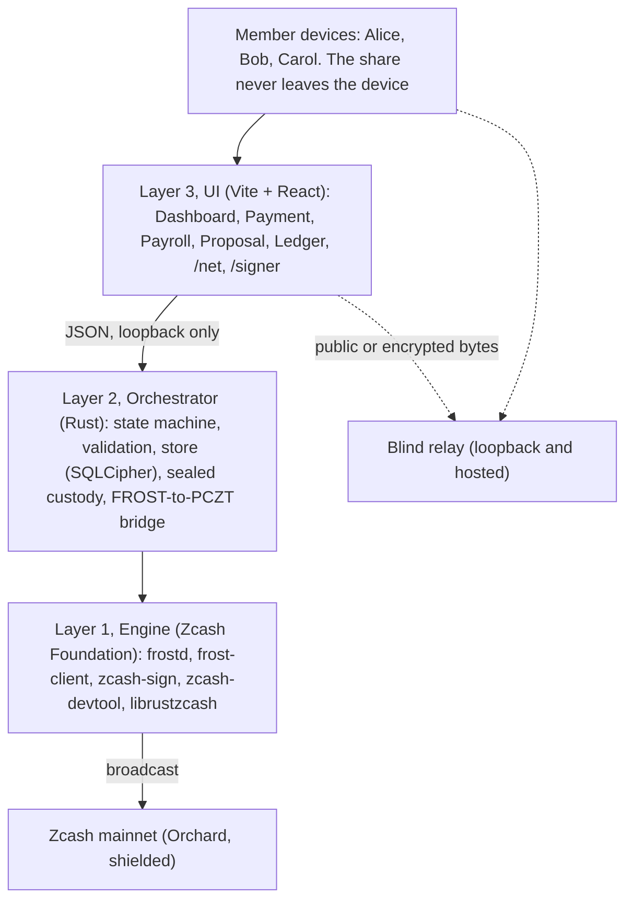
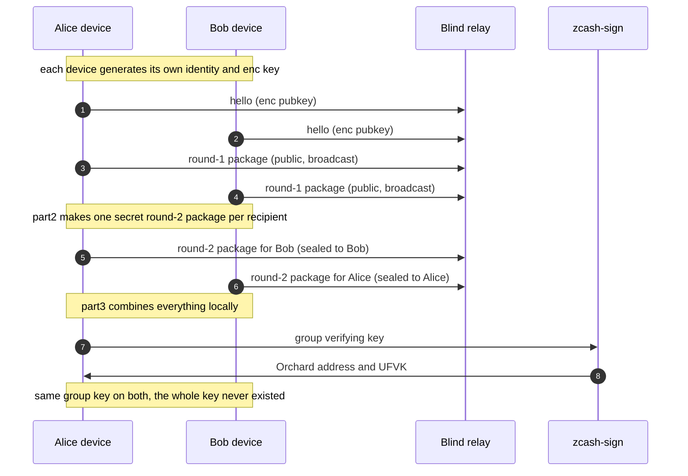
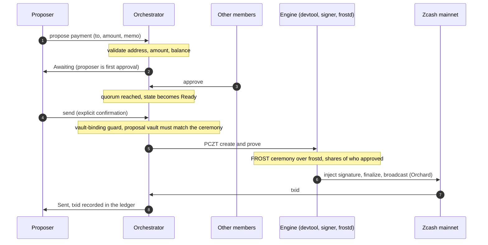
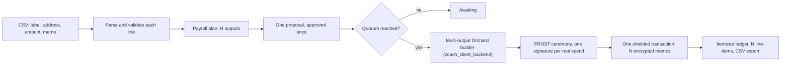
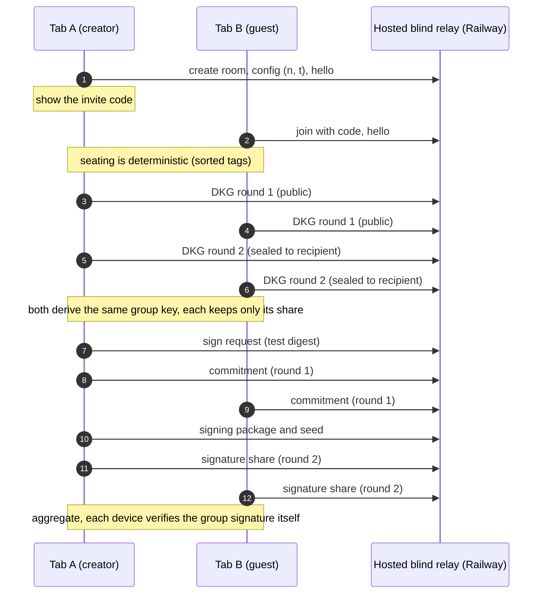
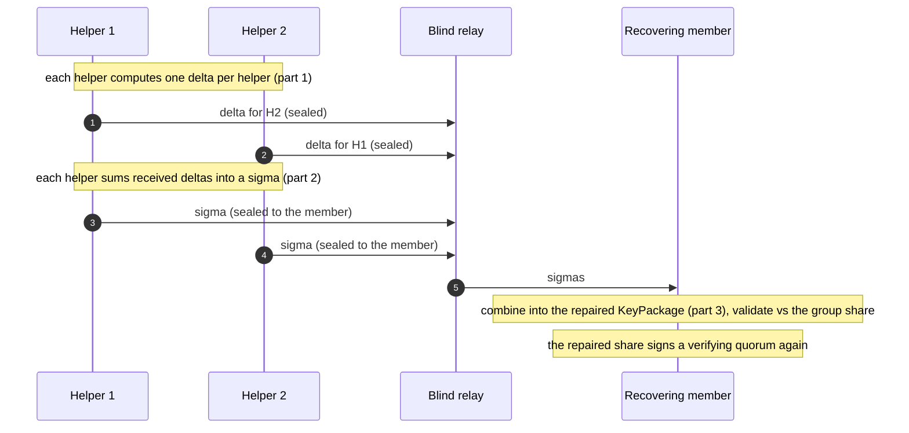
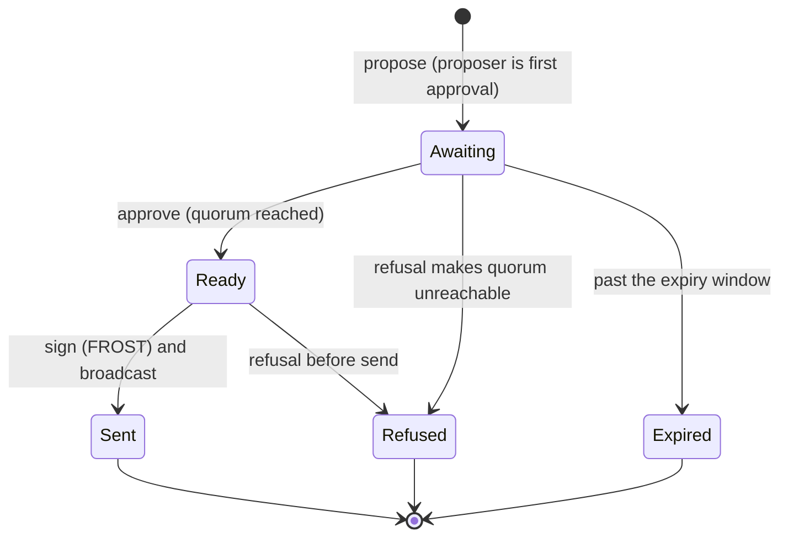
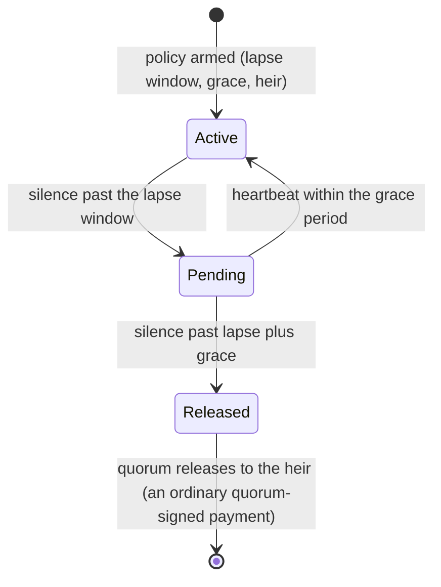
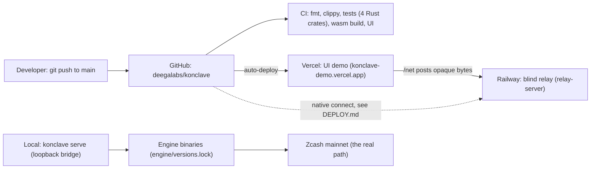
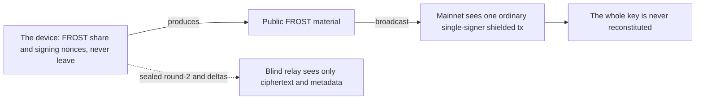

# Konclave: system diagrams

Complete system flow of Konclave, from the current MVP through the delivered roadmap. All
diagrams are Mermaid and render on GitHub. Two vocabularies appear throughout: **public
material** (commitments, signing packages, signatures) crosses the wire freely, while a
**share** (the secret piece of the key) never leaves its device.

## 1. System overview (three layers)

## 2. Create a vault by Distributed Key Generation

The key is generated distributed and is never reconstituted. Only public round-1 packages and
sealed round-2 packages cross the relay.

## 3. Quorum payment (propose, approve, sign, broadcast)

## 4. Private payroll (N outputs, one approval)

## 5. Multi-device FROST in the browser (the /net flow, live over the internet)

## 6. Social recovery (Repairable Threshold Scheme)

A member loses a device. A quorum of helpers rebuilds that member's share. The group key is
untouched, no share is revealed, and the repaired share is byte-identical to the lost one.

## 7. Proposal state machine

## 8. Inheritance, the dead-man's-switch

## 9. Deployment topology

## 10. The trust boundary, at a glance

