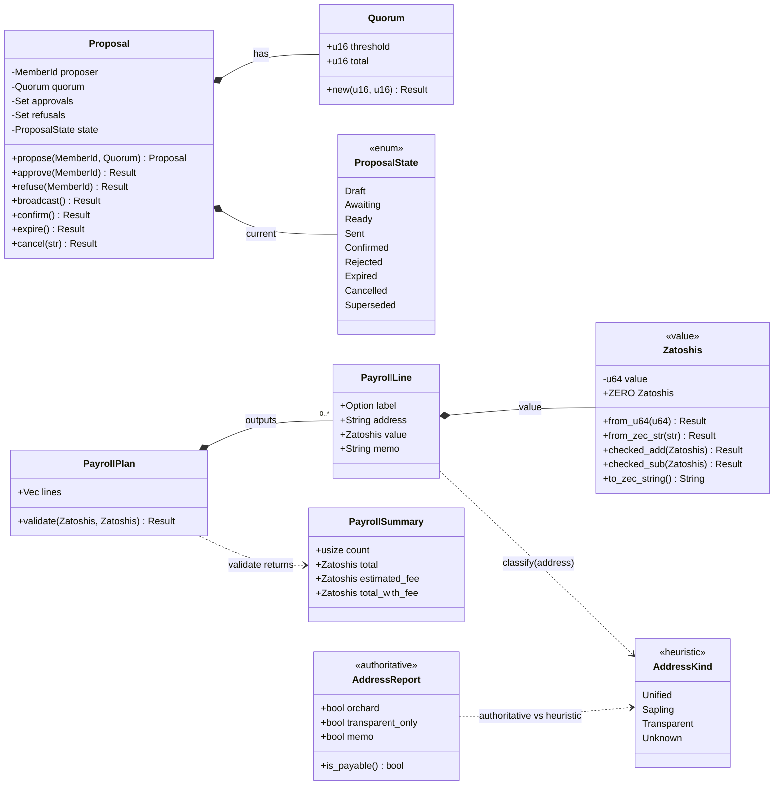
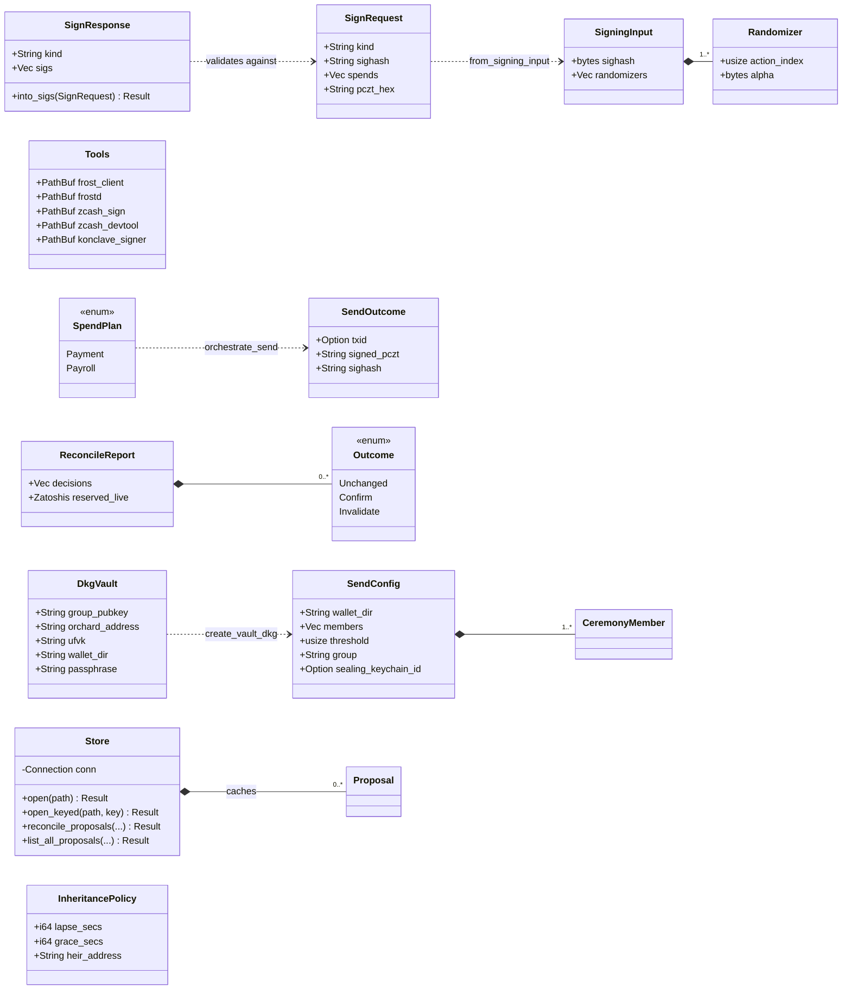
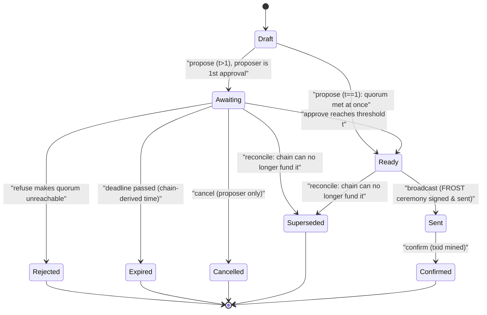
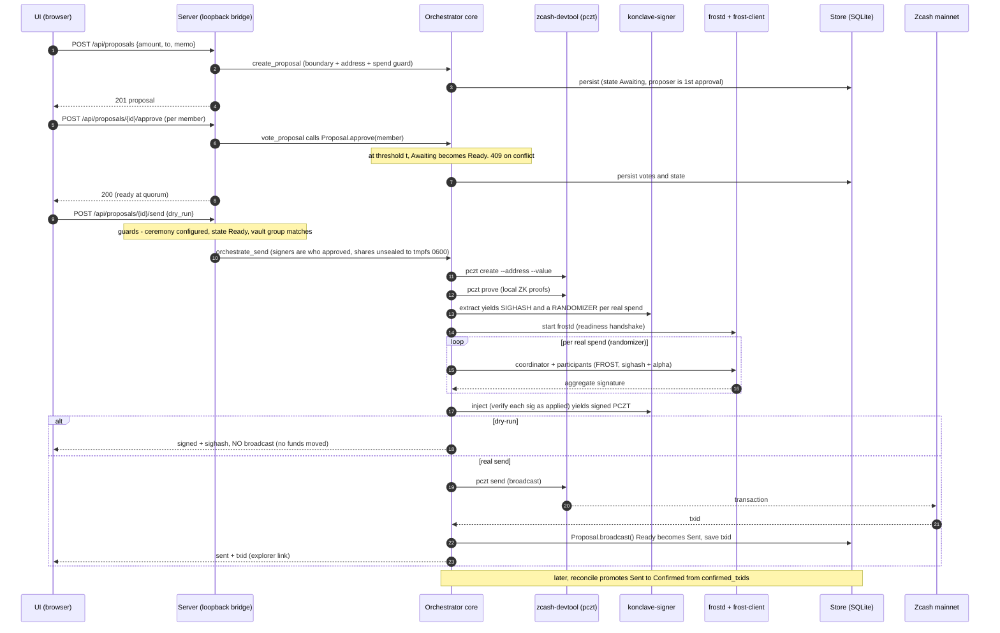
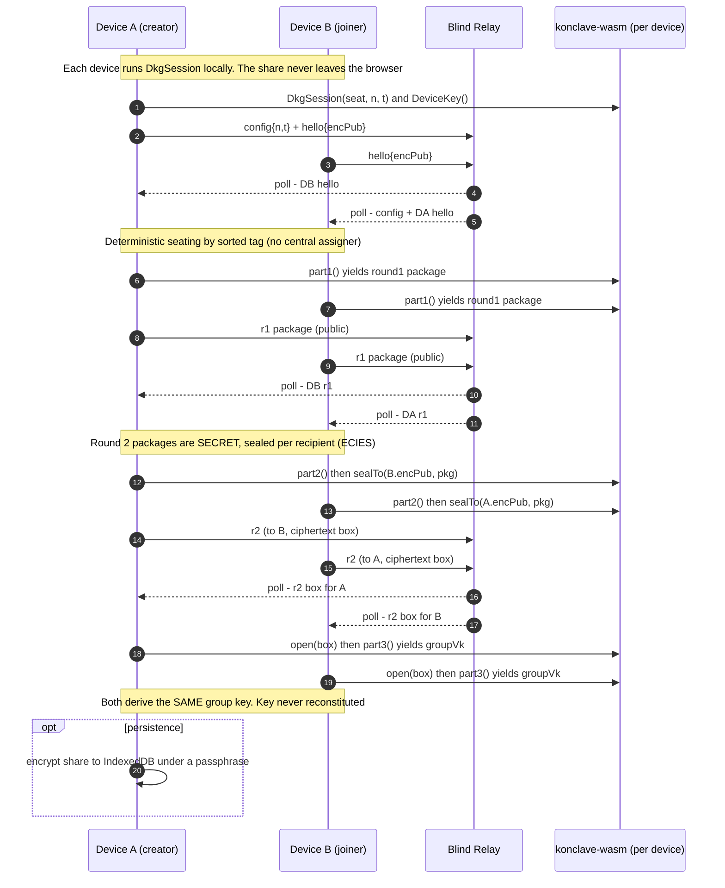
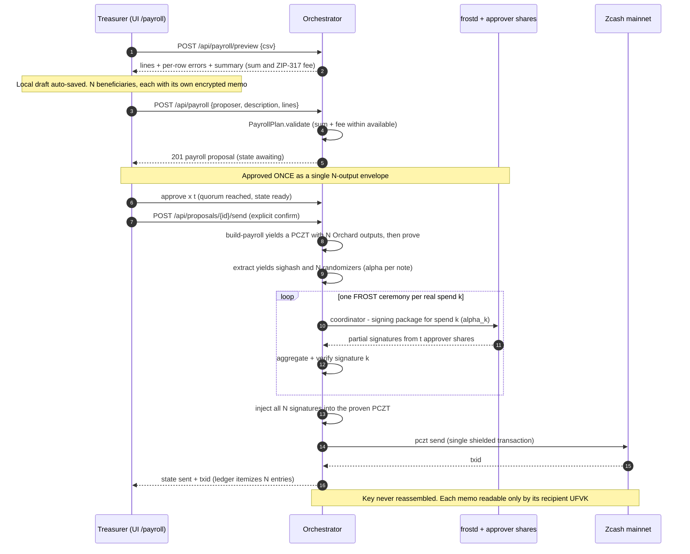
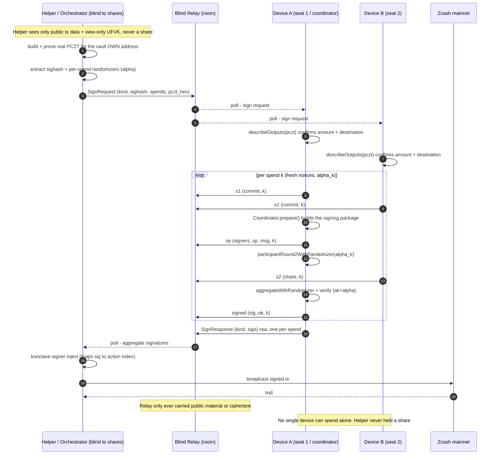

# Konclave - Complete Guide

> The end-to-end guide to how Konclave works and how to use it: use cases, domain
> model, state machine, sequence diagrams, step-by-step walkthroughs, the key
> processes explained, and honest tips. Everything here is grounded in the real
> code (`orchestrator/src/*`, `ui/src/*`, `konclave-wasm/`, `konclave-signer/`).

**Konclave** is a local-first app that lets a group create and operate a **collective,
private, single-person-proof fund vault** on Zcash using **threshold signatures (FROST)**.
Two equally weighted faces: **quorum-approved payment** and **private payroll**. The
cryptography is the Zcash Foundation's; Konclave is the **human layer** on top.

**Design rule:** *hide the cryptography, expose the trust.* You never see "FROST", "DKG",
or "SIGHASH" - you see *vault, members, approval, payment*.

---

## Contents

1. [The three layers](#1-the-three-layers)
2. [Domain model (class diagrams)](#2-domain-model-class-diagrams)
3. [The proposal state machine](#3-the-proposal-state-machine)
4. [Use-case catalog](#4-use-case-catalog)
5. [Sequence diagrams](#5-sequence-diagrams)
6. [Key processes explained](#6-key-processes-explained)
7. [Step-by-step quick reference](#7-step-by-step-quick-reference)
8. [Tips & gotchas](#8-tips--gotchas)
9. [Honest status ladder](#9-honest-status-ladder)

---

## 1. The three layers

```
  Layer 3 · UI            Vite + React (vault · members · payment · payroll · proposal · ledger)
     │  structured JSON over a loopback-only bridge (127.0.0.1), Host-gated + per-session CSRF
  Layer 2 · ORCHESTRATOR  Rust: proposal state machine · validation (ZIP-317, addresses) ·
     │                    payroll · sealed key custody · SQLite/SQLCipher store · FROST↔PCZT bridge
     │  structured I/O (never "screen-scraping" a CLI)
  Layer 1 · ENGINE        official Zcash Foundation tools (crypto is NOT reimplemented):
                          frostd · frost-client · zcash-sign · zcash-devtool · librustzcash
```

Each layer has a clear job. The orchestrator never reimplements cryptography - it wraps the
official binaries with **structured output** and adds the usability, orchestration, and
accounting layer. See [ARCHITECTURE.md](ARCHITECTURE.md) for the full module map.

---

## 2. Domain model (class diagrams)

### 2.1 Core domain

The money type, the proposal + its votes, the payroll plan, and the two address layers.



**Two address layers by design:** `validation::AddressKind` is a fast, non-authoritative
prefix heuristic that drives the "public destination" UX warning; `address::AddressReport`
(via `validate_recipient`) is the authoritative `zcash_address` decode - receiver-pool +
network gate - and is the real guard against the "Sapling address = locked funds" risk.

### 2.2 Orchestration, store & network

The subprocess driver, the encrypted store, the send pipeline, reconciliation, the
Architecture-B wire protocol, and the browser engine.



### 2.3 Type → module → responsibility

| Type / area | Module | Responsibility |
|---|---|---|
| `Zatoshis`, `MoneyError` | `money.rs` | Checked zatoshi value type; float-free ZEC parsing. The only unit value-math trusts. |
| `Quorum`, `Proposal`, `ProposalState`, `ProposalError` | `proposal.rs` | The auditable proposal + votes; 9 lifecycle states; guarded `from→to` transitions. |
| `PayrollPlan`, `PayrollLine`, `PayrollSummary`, `import_csv` | `payroll.rs` | N-output payroll: one line per beneficiary; aggregate + ZIP-317 validation; CSV import. |
| `AddressKind`, ZIP-317 fee fns, `ValidationError` | `validation.rs` | Boundary validation: fee estimate, memo/value rules, available-to-propose, prefix heuristic. |
| `AddressReport`, `validate_recipient` | `address.rs` | Authoritative `zcash_address` decode: receiver-pool + network gate. |
| `Store`, `VaultRecord`, `ProposalRecord`, `Member`, `Beneficiary` | `store.rs` | Encrypted SQLite (SQLCipher) cache of public material + votes; ledger + reconcile persistence. |
| `Tools`, `ToolError` | `tools.rs` | Subprocess driver for the official binaries; non-zero exit → error with stderr. |
| `Balance`, `ChainInfo`, `list_confirmed_txids` | `wallet.rs` | Read-side wallet: parse `zcash-devtool` JSON (balance / get-info / list-tx). |
| `SigningInput`, `Randomizer`, `inject` | `signer.rs` | Bridge to `konclave-signer`: extract sighash + randomizers, inject FROST sigs. |
| `pczt::create/prove/send` | `pczt.rs` | Drive `zcash-devtool pczt`; validate broadcast output (reject expired even on exit 0). |
| `Frostd`, `run_coordinator`, `run_participant` | `ceremony.rs` | `frostd` lifecycle (killed on drop) + coordinator/participant FROST roles. |
| `SendConfig`, `SpendPlan`, `SendOutcome`, `orchestrate_send` | `send.rs` | End-to-end Ready→Sent: build/prove PCZT → ceremony → inject → broadcast (dry-run capable). |
| `DkgVault`, `create_vault_dkg` | `dkg.rs` | Create a vault by real DKG through the app; shares sealed, key never reconstituted. |
| `ReconcileReport`, `Outcome`, `reconcile` | `reconcile.rs` | Pure "on-chain wins" engine: confirm sent txids, invalidate underfunded reservations (FIFO). |
| `InheritancePolicy`, `SwitchState`, `evaluate` | `inheritance.rs` | Pure dead-man's-switch policy: heartbeat → lapse → grace → release-authorized. |
| `SignRequest`, `SignResponse` | `net_send.rs` | Architecture-B wire protocol: helper publishes a signing request, validates aggregate sigs. |
| relay `Msg`/`RelayState`; `RelayClient` | `relay.rs`, `relay_client.rs` | Blind in-memory mailbox + poll/post transport (forwards opaque bytes only). |
| `seal`/`unseal`, `KeyStore`, `KeychainStore` | `secrets.rs` | XChaCha20-Poly1305 sealing of shares at rest; keychain trait; ephemeral 0600 unseal. |
| `DkgSession`, `Coordinator`, `DeviceKey`, `RecoveryHelper` | `konclave-wasm/src/lib.rs` | Browser engine: in-tab DKG, FROST signing, ECIES device keys, RTS recovery - shares never cross to JS. |

---

## 3. The proposal state machine

The domain's spine: 9 states, every transition guarded. `Superseded` is the newest terminal
state and is the **only** one not reachable from `Proposal`'s own methods - it is applied
exclusively by reconciliation (`Store::reconcile_proposals` mapping `Outcome::Invalidate`).



- `propose` sets `Ready` immediately when `threshold == 1`, otherwise `Awaiting`.
- `approve`/`refuse` only act from `Awaiting`; a conflicting vote errors; votes are idempotent.
- `refuse` auto-rejects when `total - refusals < threshold`.
- `broadcast`/`confirm`/`expire`/`cancel` are strict `from→to` guards.

---

## 4. Use-case catalog

Cross-cutting guarantees that hold across every use case:

- **The key is never reassembled.** DKG and every signing ceremony produce shares / partial
  signatures only; no code path reconstitutes the group secret.
- **Preview + explicit confirm before money moves.** Every fund-moving screen renders a
  preview, and the real broadcast is gated behind a danger dialog.
- **Shares sealed at rest** (XChaCha20-Poly1305), unsealed only to ephemeral 0600 tmpfs files
  during signing.
- **The loopback bridge is Host-gated + per-session CSRF token.** Reads fall back to a
  coherent mock so screens always render.

| # | Use case | Route | Actor |
|---|---|---|---|
| UC-1 | Create a vault (DKG, in-vault modal) | `/vaults` (embedded `<NetVault embedded />`) | Treasurer |
| UC-2 | Create / join a vault across devices | `/vaults` modal (standalone `/net` is legacy/diagnostics) | 2-3 browser devices |
| UC-3 | Fund / Receive | `/receive` | Sender / treasurer |
| UC-4 | Propose a payment | `/pay` | A member (proposer) |
| UC-5 | Approve / Refuse (quorum) | `/proposal` | Members |
| UC-6 | Sign & send (FROST broadcast) | `/proposal` | Operator + approvers' shares |
| UC-7 | Private payroll | `/payroll` | Proposer + quorum |
| UC-8 | Social recovery (RTS) | `/recovery` | Quorum of helpers |
| UC-9 | Inheritance / dead-man's-switch | `/inheritance` | Owner + quorum + heir |
| UC-10 | Browser signer demo | `/signer` | Visitor |
| UC-11 | Ledger / accounting export | `/ledger` | Treasurer / accountant |
| UC-12 | Members registry | `/members` | Treasurer |
| UC-13 | Beneficiaries registry | `/people` | Treasurer |

### UC-1 - Create a vault (DKG, in-vault modal)
- **Where:** the real create path is the embedded `<NetVault embedded />` modal launched from
  `/vaults` ([ADR-0009](adr/0009-vault-ia-restructure.md)), so creation happens inside the vault
  shell without ejecting to a separate route. The old standalone `/create` / `/net` routes remain
  as legacy / diagnostics surfaces.
- **Precondition:** for the local-mode DKG, bridge running + engine binaries + `frostd` available;
  for the browser-native path, the blind relay (and helper) reachable.
- **Flow:** name the vault, list members, choose quorum `t of n` → a real DKG runs (`frost-client
  init` ×N → contact exchange → concurrent `frost-client dkg -C redpallas` over `frostd` → group
  key → `zcash-sign generate --ak` → Orchard address + UFVK → view-only wallet → **seal each
  share**). The result screen shows the one-time vault passphrase, receive address, group key;
  "Go to vault" is gated on acknowledging the passphrase is saved.
- **Quorum default:** the create flow defaults to **`2-of-3`** (redundant by construction) and, if
  you pick `n === t` (e.g. 2-of-2), shows a **non-blocking warning badge** that a lost device then
  locks the funds ([ADR-0010](adr/0010-quorum-redundancy-default.md)). It is a product guardrail,
  not a protocol constraint: `n === t` is still allowed.
- **Postcondition:** a vault with sealed shares, key never reconstituted.
- **Honest limits:** single-device demo runs all participants as threads; the legacy `/create`
  invite codes are illustrative (the real product uses each member's `frost-client` contact token).

### UC-2 - Create / join a vault across devices (in-vault modal; standalone `/net` is legacy)
- **Flow:** creator generates a room code and announces `config{n,t}` + a device-key hello;
  joiners announce their hellos; deterministic seating by sorted tag. Then DKG over the relay:
  round-1 packages broadcast (public), round-2 packages **sealed per recipient** (ECIES:
  X25519 → HKDF-SHA256 → XChaCha20-Poly1305), round-3 combined locally. All devices derive the
  **same** group key. Optional: save the share encrypted in IndexedDB (restore without redoing
  DKG).
- **Honest limits:** an unsaved share is lost on reload (persistence closes that). Live proof is
  across two tabs / two hosted contexts; multi-note over the live relay is unit-tested.

### UC-3 - Fund / Receive
- **Flow:** the screen reads the vault's shielded **Orchard** address and renders it + a QR + a
  **ZIP-321** `zcash:` payment URI (optional amount), all client-side. Funds land in the vault's
  Orchard pool; balance appears after sync.
- **Honest limits:** receiving needs no key or signature; the receive address is Orchard
  (shielded-first). Post-NU6.3 the vault's **spendable** balance is **Orchard + Ironwood
  combined** - a legacy Orchard note can be spent or migrated into the Ironwood pool, and Ironwood
  notes are spendable in their own right (see the post-Ironwood note in §8).

### UC-4 - Propose a payment
- **Flow:** pick a beneficiary or paste an address; enter value + optional memo (≤512 bytes).
  Live classification warns on transparent (public), Sapling (locked-funds risk), or unknown
  destinations. Submit → boundary validation + **authoritative address guard**
  (`validate_recipient`) + spend guard vs. real balance server-side.
- **Postcondition:** a proposal in `awaiting`, proposer auto-counted as the first approval.
- **Honest limits:** backend re-validates (400 on Sapling-only / wrong-network / malformed /
  insufficient).

### UC-5 - Approve / Refuse (quorum)
- **Flow:** the proposal detail shows the state trail, amount, per-person stance, and progress
  `count/threshold`. Approve/Refuse posts the vote; the authoritative state machine returns `409`
  on a conflicting/out-of-state vote. At `t` approvals the state flips to `ready`.
- **Postcondition:** `ready` at quorum, or `rejected`/still `awaiting`. **Approval binds the
  share that signs** - whoever approved is whose config signs.
- **Honest limits:** a proposal can hit `expired` (72h placeholder) - terminal, cannot be sent.

### UC-6 - Sign & send (FROST broadcast)
- **Flow:** optionally **validate (dry-run)** - the whole chain except broadcast, returning a
  sighash with no funds moved. **Sign & send** requires the explicit danger-dialog confirm, then
  broadcasts. On success the proposal becomes `sent` with the `txid` + explorer link.
- **Postcondition:** `sent` (later `confirmed` via reconcile); only the approvers' shares signed.
- **Honest limits:** `frostd` is started fresh per call, killed on drop; the ceremony can take
  30-60s.

### UC-7 - Private payroll
- **Flow:** build the document (accrual period + description); add rows manually, from the
  registry, or import CSV (`label,address,amount,memo`) parsed locally. Per-row issues +
  public/Sapling warnings; live aggregate (count, Σ, ZIP-317 fee, balance-after); local
  auto-saved draft. Submit → one payroll proposal = **N outputs in one Orchard envelope**,
  aggregate-validated. Approved **once**, then signed as **N-spend FROST** (one ceremony per
  real note).
- **Postcondition:** a single shielded transaction with N encrypted per-beneficiary memos; the
  ledger itemizes it as N entries.
- **Honest limits:** line count bounded by max tx size; each memo is private to that recipient's
  UFVK. Proven on mainnet (txid `b1e24c07…`).

### UC-8 - Social recovery (RTS)
- **Flow:** a lost share is rebuilt by a quorum of helpers via the Repairable Threshold Scheme
  entirely in the browser: round-1 helper deltas (public) → round-2 delta exchange → round-3 the
  recovering device combines into the repaired KeyPackage, validated against the group's public
  share. The repaired share is byte-identical and signs a verifying 2-of-3.
- **Honest limits:** core proven in WASM/tests; not yet wired into a live vault UI.

### UC-9 - Inheritance / dead-man's-switch
- **Flow:** configure the policy (silence window, cancellable grace, heir address). `evaluate`
  maps silence → `Active`/`Pending`/`Released` (skew-safe). On `Released`, the quorum may release
  to the heir **as an ordinary quorum-signed payment** (reuses the FROST send path).
- **Honest limits:** the screen moves no funds - it is a pure policy visualization; the engine is
  pure and tested.

### UC-10 - Browser signer demo
- **Flow:** "Run" performs a full 2-of-3 rerandomized-redpallas FROST ceremony entirely in WASM.
  "Read the real PCZT" reads a real mainnet DKG-vault-send PCZT, describes its outputs, extracts
  randomizers, and reconstructs the exact broadcast signed PCZT (linking to `/proof`).
- **Honest limits:** the "Run" ceremony signs a demo digest; the bridge reads/reconstructs an
  existing signature - it does not re-sign real funds.

### UC-11 - Ledger / accounting export
- **Flow:** the full ledger (terminal states included) with a document band (vault, period,
  count, settled-out/open totals); filter by state and kind; payroll rows expand per beneficiary.
  Export **itemized** CSV (1 payment = 1 row, payroll of N = N rows, RFC-4180 escaped) or
  print/PDF. Settled rows link to the explorer via `txid`.
- **Honest limits:** read-only; the itemized CSV is the accounting-track deliverable.

### UC-12 - Members registry
- **Flow:** displays the real members (name + FROST comm pubkey), coordinator vs. signer role,
  and the quorum seal `t of n`.
- **Honest limits:** membership is fixed at DKG; this screen is a viewer, not an editor.

### UC-13 - Beneficiaries registry (address book)
- **Flow:** list/register/edit/delete beneficiaries (name, address, default memo, public flag);
  classification warns on transparent/Sapling. Registered people feed the pickers on `/pay` and
  `/payroll`.
- **Honest limits:** no update endpoint - edit = add-then-delete; scoped per selected vault.

---

## 5. Sequence diagrams

### 5.1 Quorum payment (propose → approve → sign → broadcast → ledger)



### 5.2 DKG vault creation across devices (blind relay)



### 5.3 Private payroll (one shielded tx, N memos, N-spend FROST)



### 5.4 Multi-device signing - Architecture B

The browser devices keep the shares and sign; a **helper** builds, proves, injects, and
broadcasts - and never sees a share. Fits "internal transparency, external privacy". The helper
comes in two forms, same blind contract either way: the **hosted blind `helper-server`** (a real
CI-tested crate deployed on Railway, ADR-0006 Rung A) for the web/browser-native path, or the
**native `orchestrator`** (`konclave serve`) as the equivalent **local-mode** helper.



---

## 6. Key processes explained

**The FROST↔PCZT bridge (`konclave-signer`).** FROST signs a *sighash*; Zcash spends live in a
*PCZT* (Partially Created Zcash Transaction). `konclave-signer extract` reads a proven PCZT and
emits the sighash plus one randomizer (`alpha`, the Orchard rerandomization) per real spend;
after the ceremony, `konclave-signer inject` writes each aggregate signature back into the PCZT
and **verifies it as applied**, rejecting an out-of-range index or a non-verifying signature.
This crate was born to resolve the pczt version gap between frost-tools and zcash-devtool, and
is the birth of the orchestrator.

**Key custody & sealing (`secrets.rs`).** A share never sits in plaintext on disk. It is sealed
with XChaCha20-Poly1305 (passphrase via Argon2id, or a sealing key from the OS keychain), and
unsealed only into an ephemeral **0600 file in tmpfs** during a signing ceremony, removed by a
RAII guard. The `frost-client` configs used by the ceremony are the sealed ones.

**The blind relay (`relay.rs`, `relay-server/`).** An in-memory room mailbox that forwards only
opaque bytes - public DKG packages or already-encrypted (ECIES-sealed) round-2 packages. It
cannot read what it carries. Public by design (CSRF-exempt) yet Host-gated on the loopback
bridge; the standalone hosted version adds CORS + rate-limit + presence pruning.

**Reconciliation (`reconcile.rs`).** A pure "on-chain wins" engine: given the freshly-synced
spendable balance and the wallet's confirmed txids, it promotes a `Sent` proposal whose txid
mined to `Confirmed`, and invalidates (→ `Superseded`) live reservations the chain can no longer
fund, FIFO by `created_at` so every device agrees. Triggered by `POST /api/vault/reconcile`.

**ZIP-317 validation (`validation.rs`).** Every value crossing a boundary funnels through the
checked `Zatoshis` type; the fee is estimated per ZIP-317, and a payment/payroll is rejected
before the builder if `sum + fee > available`.

---

## 7. Step-by-step quick reference

The everyday flow, route by route:

1. **Create or join a vault** - open the create modal from `/vaults` (the embedded
   `<NetVault embedded />` flow; standalone `/create` and `/net` are legacy/diagnostics). Members +
   quorum (defaults to 2-of-3); key born by DKG, never whole.
2. **Fund it** (`/receive`) - share the Orchard address (QR + ZIP-321) and receive ZEC.
3. **Propose a payment** (`/pay`) - amount + recipient; address + balance validated up front.
4. **Approve to quorum** (`/proposals` → a proposal) - approve/refuse; nothing moves until `t`;
   proposals expire.
5. **Sign & send** - dry-run to verify, then confirm to broadcast; only the approvers' shares
   sign; the key is never reassembled.
6. **Payroll** (`/payroll`) - CSV of beneficiaries → one shielded tx, N encrypted memos, approved
   once.
7. **Account** (`/ledger`) - full internal ledger + itemized CSV for the accountant.

Try it with demo data at [konclave-demo.vercel.app](https://konclave-demo.vercel.app); run it for
real per the README's **Try it** section; the same walkthrough is in-app under `/docs`.

---

## 8. Tips & gotchas

- **Sapling ≠ Orchard.** A Sapling-only destination can lock funds; Konclave decodes the address
  authoritatively (`validate_recipient`) and blocks it with a clear message - heed the warning.
- **Memos are Orchard-only.** Transparent (public) destinations cannot carry a memo; the memo
  field is disabled for them, and a transparent payment is flagged as **public on-chain**.
- **Approval binds the signer.** Whoever approves is whose share signs. Approve as the member you
  intend to sign as.
- **Dry-run first.** The send path has a dry-run that runs the whole ceremony and stops *before*
  broadcast - use it to verify a proposal signs, with zero funds moved. (Note: the dry-run's
  inject verifies the FROST signature it applied, not the full bundle - see the Ironwood note.)
- **The ceremony takes 30-60s.** `frostd` is started fresh and killed on drop; there is no client
  timeout, so let it finish.
- **Post-Ironwood spends.** Spending a single legacy Orchard note can produce an
  Orchard→Ironwood migration whose dummy spend the FROST inject does not sign; the interim
  workaround is `pczt create-max` (spend all notes, so every action is real). The proper fix
  lands with the engine bump to a librustzcash including upstream `#2777`.
- **A reload can lose an unsaved `/net` share.** Save it (encrypted IndexedDB) if you want to
  restore without redoing the DKG.
- **The hosted demo is mock data.** The real proof is on-chain - run `node scripts/verify-proof.mjs`
  or see [PROOF.md](PROOF.md).

---

## 9. Honest status ladder

What is shipped, dry-run-only, or roadmap - validated against the code (not just prose):

| Capability | Status |
|---|---|
| Quorum payment (propose → approve → sign → broadcast) via the UI | **Proven on mainnet** (txid `43433a10…`) |
| Private payroll (one shielded tx, N memos) | **Proven on mainnet** (txid `b1e24c07…`) |
| Send from a **real DKG** vault | **Proven on mainnet** (txid `aab00f90…`) |
| **Browser-signed** broadcast (each tab signs in-browser over the relay) | **Proven on mainnet** (txid `3022420a…`) - *two tabs on one machine* |
| Broadcast across **separate physical devices** (carried to a confirmed txid) | **Open milestone** (the distributed protocol is proven; separate-device hardware is not yet) |
| **Ironwood / NU6.3** (Orchard→Ironwood migration + first Ironwood-pool spend) | **Proven on mainnet** (`54266f47…`, `36c60f1e…`) |
| C6 signer tests (extract/inject vectors) | **Closed** (real Ironwood PCZT vectors, tests green) |
| `/net` multi-device - single-spend live | **Done** (part of the browser-signed broadcast) |
| `/net` multi-device - **multi-note over the live relay** | **Wired + unit-tested; live proof pending** |
| On-device share persistence + sign-after-restore | **Wired + live-exercised; `storage.ts` lacks a direct unit test** |
| Social recovery (RTS) / Inheritance policy engine | **Core proven by tests; not yet wired into a live vault UI** |
| Tauri single desktop binary | **Shipped** (desktop app **v0.2.0**, 2026-08-03, `src-tauri/`: Windows/macOS/Linux installers). Open: live per-platform hardware validation. The loopback bridge remains the local delivery form; see [ADR-0004](adr/0004-local-http-bridge.md) |

See [CLAIMS.md](CLAIMS.md) and [PROOF.md](PROOF.md) for the authoritative, evidence-linked ladder.

---

*This guide is generated from the code and kept honest. If something here disagrees with the
code, the code wins - please open an issue.*
