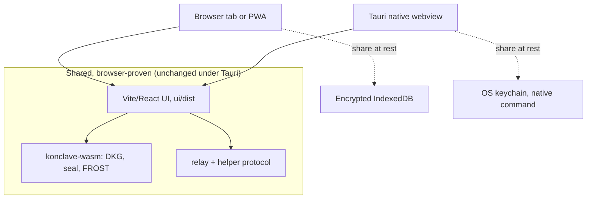
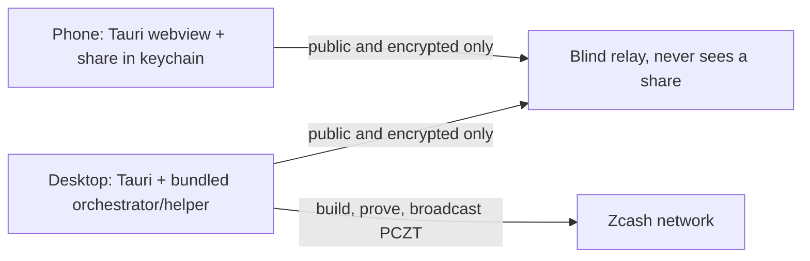

# TAURI-PLAN.md: a native shell for Konclave, honestly scoped

**Status: PLAN + UNVALIDATED SCAFFOLD.** Nothing in `src-tauri/` has been compiled or run in
this repo's environment. The dev machine's WSLg/GTK webview does not paint a window
([ADR-0004](adr/0004-local-http-bridge.md)), and no macOS / iOS / Android build host was
available. This document is groundwork: it says what a native Konclave would be, what it
reuses, what it adds, and exactly what still needs real hardware to prove. Where a claim
cannot be checked without a build, it is labelled as such rather than asserted.

This plan is consistent with the two prior delivery decisions and does not reopen them:

- [ADR-0004](adr/0004-local-http-bridge.md): Tauri packaging is a roadmap item; the loopback
  HTTP bridge is the working transport today. Tauri changes the delivery form, not the trust
  model.
- [ADR-0005](adr/0005-web-first-delivery.md): web-first is primary; native shells are optional
  wrappers. A Tauri shell is exactly such a wrapper.

## 1. The key insight: Tauri reuses what the browser already proved

Konclave's client is already a browser app. The `/net` flow runs a real cross-device DKG and a
FROST signing ceremony entirely in-browser via `konclave-wasm`, over the blind relay, with the
share held in encrypted IndexedDB (`ui/src/storage.ts`). ADR-0005 records this is proven
device-to-device on the hosted relay.

A Tauri app is a native OS webview pointed at a web bundle. So a Tauri Konclave loads the same
`ui/dist` and runs the same code. The scaffold wires this with one line of config:
`tauri.conf.json` -> `build.frontendDist: "../ui/dist"`.

### What is ALREADY validated by the browser path (carries over unchanged)

These need no re-validation under Tauri, because Tauri runs the identical JS/WASM:

- The React UI and all screens (`ui/`).
- `konclave-wasm` crypto: DKG (`DkgSession`), the confidential channel (`sealTo`/`open`), and
  FROST signing (`Coordinator`, `participantRound1/2`).
- The relay transport (`ui/src/net.ts`) and the helper signing-request protocol
  (`ui/src/net-sign.ts`, Architecture B).
- The custody invariant: the share stays on the device, only public / encrypted material
  crosses the wire.

### What Tauri ADDS (and therefore what is genuinely new and unproven here)

- **Durable, OS-backed share persistence** in the OS keychain instead of a browser origin's
  IndexedDB (Section 3). This is the one new native surface in the scaffold.
- **Native packaging / distribution** as an installable app per OS (Section 4).
- **Offline app shell** by default: a native binary ships its own UI assets, so it opens with
  no network (the relay/helper are still needed to actually run a ceremony, exactly as on web).
- **Optionally, bundling the local `orchestrator`** so the native app can also be the helper
  and the loopback bridge on the same machine (Section 5). Not in the scaffold.

Everything in this second list is PLAN or SCAFFOLD, not validated.

## 2. Why bother, given web-first (ADR-0005)

Web-first stays primary. A native shell earns its place only for what a browser tab cannot give:

- **Durable custody.** A browser can evict IndexedDB (storage pressure, "clear site data",
  private windows). A treasurer losing a share to a cleared cache is a real failure mode. The OS
  keychain is backed up and survives browser state.
- **A real installed app.** An icon, no address bar, offline launch, OS integration. For a
  non-technical treasurer this is the difference between "a website" and "my vault app".
- **A path to bundling the orchestrator/helper** locally, so a single desktop install is a
  self-contained node (bridge + helper + UI), matching the original local-first vision.

## 3. The share-persistence swap (Rust wired + logic-tested; JS swap specified)

The goal: the SAME UI code persists its share through either the browser IndexedDB path
(`ui/src/storage.ts`) or a Tauri keychain command, chosen at runtime, with no screen rewrite.

### 3.1 What is now implemented (the native side)

- **`src-tauri/src/share_store.rs`** -- a `ShareStore` trait and an OS-keychain-backed
  `KeychainShareStore`, plus a `StoreError` with explicit variants (`Backend` / `NotFound` /
  `InvalidId`). It has NO `tauri` dependency, so its logic is covered by a REAL headless test run
  (12 tests, green) against `keyring`'s in-memory mock -- the same technique
  `orchestrator::secrets::KeychainStore` uses. Because `keyring` has no portable enumeration API,
  `list` is served from a public-id index entry the store maintains (see `NATIVE-STORAGE-BRIDGE.md`
  §6). The `keyring` pin (`3`, no backend feature) mirrors the orchestrator exactly.
- **`src-tauri/src/lib.rs`** -- four thin `#[tauri::command]`s over that store:
  `secure_store` / `secure_load` / `secure_delete` / `secure_list`. These marshal base64 at the JS
  boundary and never see plaintext key material. This wiring is SCAFFOLD (the `tauri` crate needs a
  system webview absent here, so the crate is not compiled), but the store it delegates to is
  proven.

### 3.2 The JS side (specified, not yet added)

A narrow `StorageBackend` interface both backends satisfy: `ui/src/storage.ts` verbatim for web,
and an `invoke`-based native backend. Runtime selection via `isTauri()`. The exact interface, the
`invoke` argument shapes (matching the Rust command signatures above), the sealing path, and the
one-line `NetVault.tsx` consumer change are specified in
[`NATIVE-STORAGE-BRIDGE.md`](NATIVE-STORAGE-BRIDGE.md).

It is deliberately NOT added to `ui/` yet: a live `.ts` importing `@tauri-apps/api` would break
`npm --prefix ui run build` and CI until the Tauri dependency is installed. It lands with the Tauri
work; the change is mechanical and non-breaking, and the web path stays the tested default.

### 3.2 Where encryption happens (deliberate)

The UI stays the encryptor in BOTH backends (PBKDF2 -> AES-GCM, `ui/src/storage.ts`). The
keychain only holds the resulting ciphertext. Rationale:

- One sealing path, one audited threat model, whether on web or native.
- The native command (`src-tauri/src/lib.rs`) never touches plaintext key material, so the
  Rust/webview boundary carries only opaque bytes (mirrors the relay/helper discipline).
- The keychain adds a second at-rest factor (OS account protection) ON TOP of the passphrase,
  rather than replacing it.

An alternative (keychain-only, no app passphrase, relying on OS unlock) is viable and simpler
for the user, but it drops the passphrase factor and diverges from the web path. Kept as a
documented option, not the default.

## 4. Per-platform build matrix

Legend: **scaffolded** = config/code present for it here; **plan-only** = documented, no files
specific to it; **needs-hardware** = cannot even be attempted in this environment.

| Target | Toolchain needed | Bundle | Status here | What blocks validation |
|---|---|---|---|---|
| Windows desktop | Rust + MSVC build tools, WebView2 (bundled on Win 11), Tauri CLI 2 | `.msi`, `.exe` | scaffolded, plan-only | No Windows build host in this environment. |
| macOS desktop | Rust, Xcode CLT, Tauri CLI 2; Apple Developer ID to sign/notarize | `.app`, `.dmg` | scaffolded, plan-only | Needs a Mac; signing needs an Apple ID. |
| Linux desktop | Rust, `libwebkit2gtk-4.1-dev`, Tauri CLI 2 | `.deb`, `.rpm`, AppImage | scaffolded, needs-hardware to VALIDATE | Compiles in principle, but the WSLg webview does not render here (ADR-0004), so it cannot be seen to work on this box. |
| iOS | macOS + Xcode, Apple Developer account, Rust ios targets | `.ipa` via `tauri ios` | plan-only | Impossible off a Mac; signing/provisioning required. |
| Android | Android SDK + NDK, `ANDROID_HOME`/`NDK_HOME`, Rust android targets, Tauri CLI 2 | `.apk`/`.aab` via `tauri android` | plan-only | No Android SDK/NDK installed here. |

The crate is already shaped for mobile: `src-tauri/Cargo.toml` sets
`crate-type = ["staticlib", "cdylib", "rlib"]` and `src/lib.rs` uses
`#[cfg_attr(mobile, tauri::mobile_entry_point)]`, so `tauri android init` / `tauri ios init`
have what they need. That shape is asserted from the Tauri 2 mobile docs, not from a run here.

Exact commands per target are in [`../src-tauri/README.md`](../src-tauri/README.md).

## 5. Optionally bundling the orchestrator (beyond the scaffold)

ADR-0004's loopback bridge (`konclave serve`) and Architecture B's helper are Rust in the
`orchestrator` crate. A desktop Tauri build could spawn that as a sidecar (Tauri's
`externalBin`) or link it, so one install is UI + helper + bridge on the same machine, fully
local-first. This is NOT in the scaffold (it needs the orchestrator to build for each target,
including its SQLCipher/native deps, which is its own validation effort). It is the natural next
milestone after a desktop build renders.

Mobile is different: on iOS/Android the phone is a signing device only. It holds its share and
signs in-webview; build/prove/broadcast stay off-device via a remote helper (Architecture B),
exactly as on web. No orchestrator on the phone.

## 6. Platform choice: Tauri 2.0 vs React Native vs Flutter

The native shell must reuse Konclave's two biggest assets -- the existing React UI (`ui/`) and the
Rust crypto core (`konclave-wasm` for in-browser FROST/DKG, `orchestrator` for the helper/bridge)
-- while giving OS-keychain custody and staying blind and local-first (no server holds a share).
Measured against exactly those needs:

| Need | Tauri 2.0 | React Native | Flutter |
|---|---|---|---|
| Reuse the React UI (`ui/`) | **As-is.** The webview loads `ui/dist` unchanged; every screen and the whole `/net` flow run verbatim. | Rewrite. RN is not the DOM; React components using web APIs/CSS do not port. | Rewrite in Dart/Flutter widgets. |
| Reuse the Rust crypto (`konclave-wasm`, `orchestrator`) | **Directly.** WASM runs in the webview as today; native Rust can be linked/sidecar'd (desktop) or invoked via commands. Rust is Tauri's native language. | Re-bridge. Rust reachable only via a custom native module (JSI/turbo-module) or re-run the WASM in a JS engine; extra FFI surface. | Re-bridge via Dart FFI (`dart:ffi`) or platform channels; the WASM path is awkward. |
| OS keychain (desktop + mobile) | Native Rust command over `keyring` (this scaffold) or a plugin; the same crate the orchestrator already uses. | `react-native-keychain` (mature) -- but a different code path per platform, not the Rust one. | `flutter_secure_storage` -- again a separate, non-Rust path. |
| Blind, local-first, no-server | Natural: a native binary with a bundled UI + optional local orchestrator/helper; nothing phones home. | Achievable, but the ecosystem assumes a JS backend; more to strip out. | Achievable; same caveat. |
| Single codebase desktop + mobile | Yes (desktop mature; **mobile is younger**, 2.0-era, smaller track record). | Mobile-first and very mature; desktop support is secondary/less polished. | Both mature; strong mobile, decent desktop. |
| Bundle size / footprint | Small (system webview, no bundled Chromium). | Medium. | Medium/large (bundled engine). |

**Recommendation: Tauri 2.0.** It is the only option that reuses BOTH the existing React UI and the
Rust crypto core with essentially zero rewrite -- for a solo project that is the difference between
a shippable shell and a second full front end. The honest tradeoff is that Tauri's **mobile** story
(iOS/Android under 2.0) is younger and less battle-tested than React Native's or Flutter's, and the
Linux desktop webview does not render on this dev machine (ADR-0004), so validation waits on real
hardware. React Native or Flutter would buy a more mature mobile runtime at the cost of rewriting
the UI in a non-DOM framework AND re-bridging the Rust crypto over FFI -- re-implementing, and
re-auditing, the exact parts that are already proven. That cost is not justified for this app.

## 7. Security notes

- **The share never leaves the device.** In both backends the plaintext share stays local. Over
  the wire, only public or encrypted material moves (unchanged from the browser path, §6.3/§6.4
  of CLAUDE.md). The native keychain command receives only ciphertext.
- **Keychain vs IndexedDB tradeoffs.**
  - IndexedDB is origin-scoped and app-clearable; convenient, but evictable and tied to browser
    state. It is protected only by the app passphrase.
  - The OS keychain (Windows Credential Manager / macOS + iOS Keychain / Linux Secret Service)
    is durable, OS-account protected, and survives browser resets. Cost: it is a platform
    surface with per-OS behavior (Linux Secret Service needs a running keyring daemon; headless
    Linux has no backend), so the app must degrade gracefully to the IndexedDB path when no
    keychain is present. The design keeps the passphrase factor either way.
- **The relay and helper stay blind.** Tauri changes nothing about coordination: the relay
  forwards opaque bytes, and the helper (Architecture B) builds/proves/broadcasts without ever
  holding a share. A quorum is still required to move funds; a native shell does not weaken that.
- **CSP must be tightened before release.** The scaffold ships `csp: null` so the shell loads at
  all. A real build must set a strict CSP: allow `wasm-unsafe-eval` for `konclave-wasm`, and
  restrict `connect-src` to the configured relay and helper origins only. Tracked as a build-time
  task, not a scaffold default.
- **No new trust in the packager.** Distribution (code signing, notarization, store review) adds
  supply-chain responsibilities but does not change the on-device custody guarantee.

## 8. Honest status ladder

**Code-complete + logic-tested here (headless, no Tauri build needed):**
- `src-tauri/src/share_store.rs`: the `ShareStore` trait, `KeychainShareStore`, the public-id
  index behind `list`, the id guard, error mapping, and the base64 boundary codec. **12 unit tests
  pass** against `keyring`'s in-memory mock (run in an isolated crate, since the enclosing
  `src-tauri` crate cannot compile here). Clippy `-D warnings` clean, rustfmt conformant.

**Code-complete but UNBUILT here (needs a desktop/mobile host to compile and run):**
- `src-tauri/src/lib.rs`: the four `#[tauri::command]`s (`secure_store/load/delete/list`) and the
  Tauri app builder. Correct-in-principle wiring, but the `tauri` crate needs a system webview
  (webkit2gtk/glib) absent on this machine, so it is not compiled. No green signal on the wiring.
- `tauri.conf.json`, `Cargo.toml`, `build.rs`, `capabilities/default.json`, `main.rs`: schema-valid
  Tauri 2.0 scaffold, mobile-shaped crate types, not compiled here.

**Design-only (specified, no code committed):**
- `ui/src/share-store.ts` + the `NetVault.tsx` swap: fully specified in `NATIVE-STORAGE-BRIDGE.md`
  with exact `invoke` shapes, deliberately not added so `npm run build`/CI stay green until the
  Tauri deps are installed.
- Bundling the `orchestrator`/helper as a desktop sidecar (§5).

**Needs real hardware to VALIDATE (cannot be attempted here):**
- Compile the shell on each desktop host; render a real window (blocked by WSLg/GTK, ADR-0004).
- Prove the keychain round-trip on each OS (the mock is per-`Entry`; true cross-call persistence
  only exercises on a real backend -- Windows Credential Manager / macOS + iOS Keychain / Linux
  Secret Service).
- Mobile: `tauri ios/android init` + build + sign on real Mac / Android SDK toolchains.
- Tighten CSP (the scaffold ships `csp: null`); code-sign / notarize per store.

Until the desktop/mobile builds and the keychain round-trip are proven on hardware, Konclave's
honest delivery statement stays: **web-first, proven in the browser; native shell scaffolded and
planned, with the keychain share-store logic implemented and unit-tested but not yet built into a
running app.**
