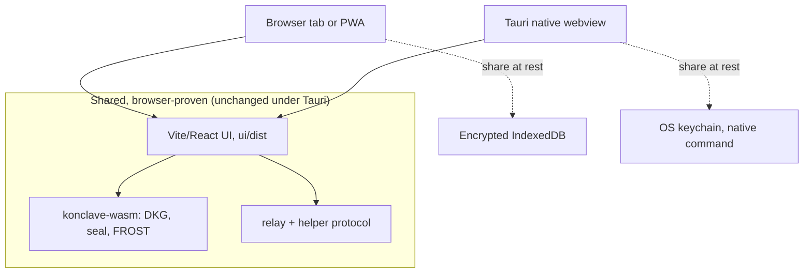
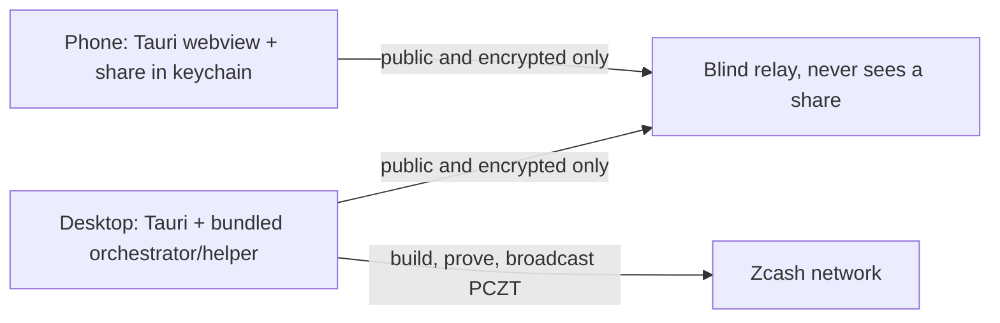

# TAURI-PLAN.md: a native shell for Konclave, honestly scoped

**Status: PLAN + UNVALIDATED SCAFFOLD.** Nothing in `src-tauri/` has been compiled or run in
this repo's environment. The dev machine's WSLg/GTK webview does not paint a window
([ADR-0004](adr/0004-local-http-bridge.md)), and no macOS / iOS / Android build host was
available. This document is groundwork: it says what a native Konclave would be, what it
reuses, what it adds, and exactly what still needs real hardware to prove. Where a claim
cannot be checked without a build, it is labelled as such rather than asserted.

This plan is consistent with the two prior delivery decisions and does not reopen them:

- [ADR-0004](adr/0004-local-http-bridge.md): Tauri packaging is a roadmap item; the loopback
  HTTP bridge is the working transport today. Tauri changes the delivery form, not the trust
  model.
- [ADR-0005](adr/0005-web-first-delivery.md): web-first is primary; native shells are optional
  wrappers. A Tauri shell is exactly such a wrapper.

## 1. The key insight: Tauri reuses what the browser already proved

Konclave's client is already a browser app. The `/net` flow runs a real cross-device DKG and a
FROST signing ceremony entirely in-browser via `konclave-wasm`, over the blind relay, with the
share held in encrypted IndexedDB (`ui/src/storage.ts`). ADR-0005 records this is proven
device-to-device on the hosted relay.

A Tauri app is a native OS webview pointed at a web bundle. So a Tauri Konclave loads the same
`ui/dist` and runs the same code. The scaffold wires this with one line of config:
`tauri.conf.json` -> `build.frontendDist: "../ui/dist"`.

### What is ALREADY validated by the browser path (carries over unchanged)

These need no re-validation under Tauri, because Tauri runs the identical JS/WASM:

- The React UI and all screens (`ui/`).
- `konclave-wasm` crypto: DKG (`DkgSession`), the confidential channel (`sealTo`/`open`), and
  FROST signing (`Coordinator`, `participantRound1/2`).
- The relay transport (`ui/src/net.ts`) and the helper signing-request protocol
  (`ui/src/net-sign.ts`, Architecture B).
- The custody invariant: the share stays on the device, only public / encrypted material
  crosses the wire.

### What Tauri ADDS (and therefore what is genuinely new and unproven here)

- **Durable, OS-backed share persistence** in the OS keychain instead of a browser origin's
  IndexedDB (Section 3). This is the one new native surface in the scaffold.
- **Native packaging / distribution** as an installable app per OS (Section 4).
- **Offline app shell** by default: a native binary ships its own UI assets, so it opens with
  no network (the relay/helper are still needed to actually run a ceremony, exactly as on web).
- **Optionally, bundling the local `orchestrator`** so the native app can also be the helper
  and the loopback bridge on the same machine (Section 5). Not in the scaffold.

Everything in this second list is PLAN or SCAFFOLD, not validated.



## 2. Why bother, given web-first (ADR-0005)

Web-first stays primary. A native shell earns its place only for what a browser tab cannot give:

- **Durable custody.** A browser can evict IndexedDB (storage pressure, "clear site data",
  private windows). A treasurer losing a share to a cleared cache is a real failure mode. The OS
  keychain is backed up and survives browser state.
- **A real installed app.** An icon, no address bar, offline launch, OS integration. For a
  non-technical treasurer this is the difference between "a website" and "my vault app".
- **A path to bundling the orchestrator/helper** locally, so a single desktop install is a
  self-contained node (bridge + helper + UI), matching the original local-first vision.

## 3. The share-persistence swap (design, not yet wired)

The goal: the SAME UI code persists its share through either the browser IndexedDB path
(`ui/src/storage.ts`) or a Tauri keychain command, chosen at runtime, with no screen rewrite.

### 3.1 The abstraction

Introduce a narrow interface that both backends satisfy. `ui/src/storage.ts` already has the
right shape (`saveVault` / `loadVault` / `listVaults` / `deleteVault`); the abstraction is a
thin `ShareStore` over it plus a Tauri implementation.

```ts
// SKETCH for ui/src/share-store.ts, NOT added to the repo yet.
// Reason it is not added: a live .ts that imports '@tauri-apps/api' would break `npm --prefix
// ui run build` and CI, because that dependency is not installed. It lands with the Tauri work.
export interface ShareStore {
  save(id: string, data: VaultData, passphrase: string): Promise<void>
  load(id: string, passphrase: string): Promise<VaultLoaded>
  list(): Promise<VaultPublic[]>
  remove(id: string): Promise<void>
}

// Runtime pick: Tauri injects a global, so the same bundle works in a browser and in the shell.
export function isTauri(): boolean {
  return typeof (globalThis as { __TAURI_INTERNALS__?: unknown }).__TAURI_INTERNALS__ !== 'undefined'
}

// Browser backend: the existing, tested module verbatim (ui/src/storage.ts, storage.test.ts).
export const indexedDbStore: ShareStore = { save: saveVault, load: loadVault, list: listVaults, remove: deleteVault }

// Native backend: the UI still derives the key and seals the share (WebCrypto works in the
// webview), then hands only CIPHERTEXT to the keychain command. The keychain is durable at-rest
// storage, NOT the encryptor. This keeps one sealing path and one threat model across backends.
export const tauriKeychainStore: ShareStore = {
  async save(id, data, passphrase) {
    const cipher = await sealShare(data.sealedShare, passphrase) // same PBKDF2/AES-GCM as storage.ts
    await invoke('keychain_set_share', { id, shareB64: b64(cipher) })
    await putPublicMeta(id, data)                                // public metadata can stay in IndexedDB
  },
  async load(id, passphrase) {
    const shareB64 = await invoke<string>('keychain_get_share', { id })
    const plain = await openShare(unb64(shareB64), passphrase)
    return { ...(await getPublicMeta(id)), sealedShare: plain }
  },
  list: listPublicMeta,
  async remove(id) { await invoke('keychain_delete_share', { id }); await delPublicMeta(id) },
}

export const shareStore: ShareStore = isTauri() ? tauriKeychainStore : indexedDbStore
```

`NetVault.tsx` would import `shareStore` instead of the four functions directly. That is a
small, mechanical, non-breaking change, deferred until the Tauri deps exist so CI stays green.

### 3.2 Where encryption happens (deliberate)

The UI stays the encryptor in BOTH backends (PBKDF2 -> AES-GCM, `ui/src/storage.ts`). The
keychain only holds the resulting ciphertext. Rationale:

- One sealing path, one audited threat model, whether on web or native.
- The native command (`src-tauri/src/lib.rs`) never touches plaintext key material, so the
  Rust/webview boundary carries only opaque bytes (mirrors the relay/helper discipline).
- The keychain adds a second at-rest factor (OS account protection) ON TOP of the passphrase,
  rather than replacing it.

An alternative (keychain-only, no app passphrase, relying on OS unlock) is viable and simpler
for the user, but it drops the passphrase factor and diverges from the web path. Kept as a
documented option, not the default.

## 4. Per-platform build matrix

Legend: **scaffolded** = config/code present for it here; **plan-only** = documented, no files
specific to it; **needs-hardware** = cannot even be attempted in this environment.

| Target | Toolchain needed | Bundle | Status here | What blocks validation |
|---|---|---|---|---|
| Windows desktop | Rust + MSVC build tools, WebView2 (bundled on Win 11), Tauri CLI 2 | `.msi`, `.exe` | scaffolded, plan-only | No Windows build host in this environment. |
| macOS desktop | Rust, Xcode CLT, Tauri CLI 2; Apple Developer ID to sign/notarize | `.app`, `.dmg` | scaffolded, plan-only | Needs a Mac; signing needs an Apple ID. |
| Linux desktop | Rust, `libwebkit2gtk-4.1-dev`, Tauri CLI 2 | `.deb`, `.rpm`, AppImage | scaffolded, needs-hardware to VALIDATE | Compiles in principle, but the WSLg webview does not render here (ADR-0004), so it cannot be seen to work on this box. |
| iOS | macOS + Xcode, Apple Developer account, Rust ios targets | `.ipa` via `tauri ios` | plan-only | Impossible off a Mac; signing/provisioning required. |
| Android | Android SDK + NDK, `ANDROID_HOME`/`NDK_HOME`, Rust android targets, Tauri CLI 2 | `.apk`/`.aab` via `tauri android` | plan-only | No Android SDK/NDK installed here. |

The crate is already shaped for mobile: `src-tauri/Cargo.toml` sets
`crate-type = ["staticlib", "cdylib", "rlib"]` and `src/lib.rs` uses
`#[cfg_attr(mobile, tauri::mobile_entry_point)]`, so `tauri android init` / `tauri ios init`
have what they need. That shape is asserted from the Tauri 2 mobile docs, not from a run here.

Exact commands per target are in [`../src-tauri/README.md`](../src-tauri/README.md).

## 5. Optionally bundling the orchestrator (beyond the scaffold)

ADR-0004's loopback bridge (`konclave serve`) and Architecture B's helper are Rust in the
`orchestrator` crate. A desktop Tauri build could spawn that as a sidecar (Tauri's
`externalBin`) or link it, so one install is UI + helper + bridge on the same machine, fully
local-first. This is NOT in the scaffold (it needs the orchestrator to build for each target,
including its SQLCipher/native deps, which is its own validation effort). It is the natural next
milestone after a desktop build renders.

Mobile is different: on iOS/Android the phone is a signing device only. It holds its share and
signs in-webview; build/prove/broadcast stay off-device via a remote helper (Architecture B),
exactly as on web. No orchestrator on the phone.



## 6. Security notes

- **The share never leaves the device.** In both backends the plaintext share stays local. Over
  the wire, only public or encrypted material moves (unchanged from the browser path, §6.3/§6.4
  of CLAUDE.md). The native keychain command receives only ciphertext.
- **Keychain vs IndexedDB tradeoffs.**
  - IndexedDB is origin-scoped and app-clearable; convenient, but evictable and tied to browser
    state. It is protected only by the app passphrase.
  - The OS keychain (Windows Credential Manager / macOS + iOS Keychain / Linux Secret Service)
    is durable, OS-account protected, and survives browser resets. Cost: it is a platform
    surface with per-OS behavior (Linux Secret Service needs a running keyring daemon; headless
    Linux has no backend), so the app must degrade gracefully to the IndexedDB path when no
    keychain is present. The design keeps the passphrase factor either way.
- **The relay and helper stay blind.** Tauri changes nothing about coordination: the relay
  forwards opaque bytes, and the helper (Architecture B) builds/proves/broadcasts without ever
  holding a share. A quorum is still required to move funds; a native shell does not weaken that.
- **CSP must be tightened before release.** The scaffold ships `csp: null` so the shell loads at
  all. A real build must set a strict CSP: allow `wasm-unsafe-eval` for `konclave-wasm`, and
  restrict `connect-src` to the configured relay and helper origins only. Tracked as a build-time
  task, not a scaffold default.
- **No new trust in the packager.** Distribution (code signing, notarization, store review) adds
  supply-chain responsibilities but does not change the on-device custody guarantee.

## 7. Honest open items before any "native app" claim

- Compile the shell on each desktop host (none available here).
- Render a real window (blocked on this machine by WSLg/GTK, ADR-0004).
- Wire `ui/src/share-store.ts` and switch `NetVault.tsx` to `shareStore` (deferred so CI stays
  green until the Tauri deps are installed).
- Prove the keychain round-trip on each OS (the base64 helper has an offline test; the keychain
  itself is untested).
- Mobile: init + build + sign on real Mac/Android toolchains.
- Optional: build the orchestrator per target for the bundled-helper desktop variant.

Until those are done, Konclave's honest delivery statement stays: **web-first, proven in the
browser; native shell scaffolded and planned, not built.**
